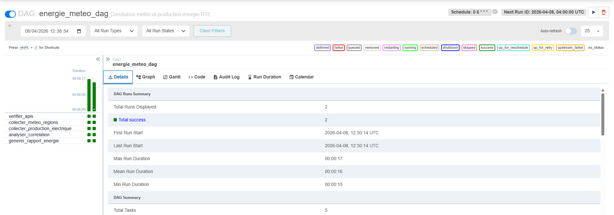
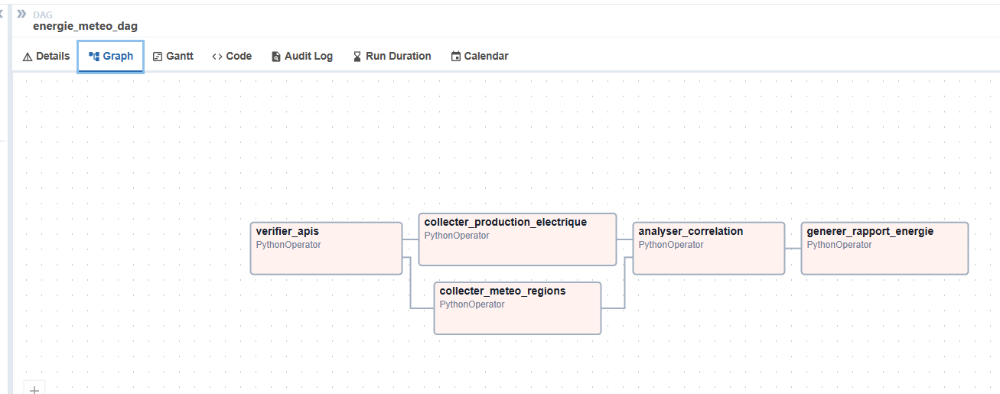
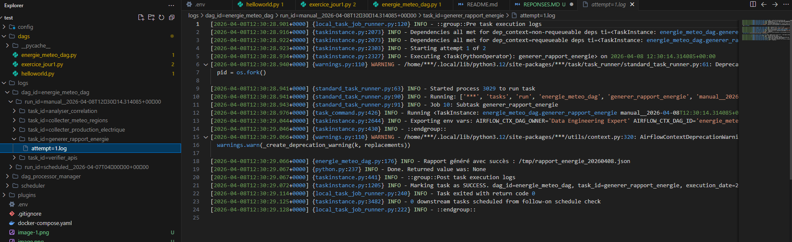
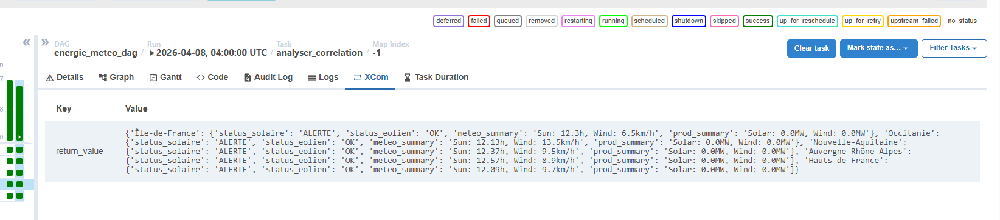
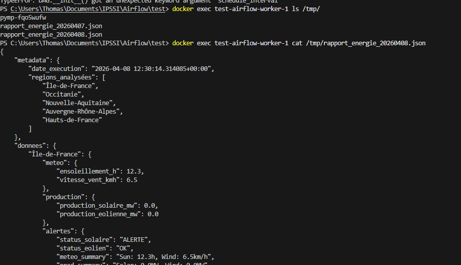

1 Interface Airfl ow UI avec le DAG energie_meteo_dag visible et en état success

2 Vue Graph du DAG montrant les 5 tâches et leurs dépendances

3. Logs d’une exécution réussie de generer_rapport_energie avec le tableau affiché

4. Onglet XCom de la tâche analyser_correlation montrant le dictionnaire d’alertes

5. Contenu du fichier JSON généré (via docker compose exec ... cat /tmp/rapport_energie_*.json)

